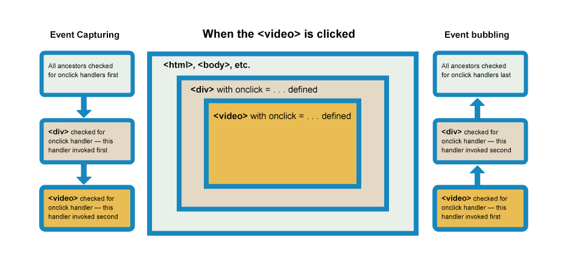

在此特地声明本文是根据 [mozilla官方教学文档](https://developer.mozilla.org/zh-CN/docs/Learn/html/Introduction_to_html) 学习的个人学习笔记，借用了大量的图片和文本内容，存在相当多的相同，但不是copy。如需查看mozilla官方文档，请点击前文链接！！
<!--more-->

<!--toc-->
- [条件语句](#条件语句)
  - [if语句](#if语句)
  - [switch语句](#switch语句)
  - [三元运算符](#三元运算符)
- [循环语句](#循环语句)
  - [for循环](#for循环)
  - [while语句](#while语句)
  - [退出循环的关键字](#退出循环的关键字)
- [函数](#函数)
  - [浏览器内置函数](#浏览器内置函数)
  - [函数与方法](#函数与方法)
  - [自定义函数](#自定义函数)
  - [调用函数](#调用函数)
  - [匿名函数](#匿名函数)
  - [函数参数](#函数参数)
  - [函数作用域和冲突](#函数作用域和冲突)
  - [函数返回值](#函数返回值)
- [事件介绍](#事件介绍)
  - [添加事件处理器](#添加事件处理器)
    - [事件处理器属性](#事件处理器属性)
    - [行内事件处理器](#行内事件处理器)
    - [addEventListener()和removeEventListener()](#addeventlistener和removeeventlistener)
    - [使用机制策略](#使用机制策略)
  - [其它事件概念](#其它事件概念)
    - [事件对象](#事件对象)
    - [阻止默认行为](#阻止默认行为)
    - [事件冒泡及获取](#事件冒泡及获取)
      - [对事件冒泡和捕捉的解释](#对事件冒泡和捕捉的解释)
      - [用 stopPropagation()修复问题](#用-stoppropagation修复问题)
      - [事件委托](#事件委托)
<!--toc-->

<br>

# 条件语句
在任何的编程语言中，代码需要依靠不同的输入作为决定并且采取行动。

<br>

## if语句
if语句是基本的条件语句，许多编程语言都有着一样或者相似的语法。

以下是简单的if语句：
```js
var shoppingDone = false;

if (shoppingDone === true) {
  var childsAllowance = 10;
} else {
  var childsAllowance = 5;
}
```

以上只有两个判断条件，两个以上或更复杂的分支可以使用以下两种结构：
- else if 语句
- 嵌套if...else

<br>

**else if 语句**
```js
var choice = 1;

if (choice === 1) {
    ...
} else if (choice === 2) {
    ...
} else {
    para.textContent = '';
}
```

<br>

**嵌套if...else**
```js
if (choice === 'sunny') {
  if (temperature < 86) {
    ...
  } else if (temperature >= 86) {
    ...
  }
}
```

将一个 if...else 语句放在另一个中，进行嵌套是符合语法的。

<br>

对于条件语句来说，准确描述条件是关键，以下是常用的：
- **比较运算符** 用来判断条件语句中的条件。
  - `===` 和 `!==` 判断一个值是否严格等于或不等于。
  - `<` 和 `>` 判断一个值是否小于或大于。
  - `<=` 和 `>=` 判断一个值是否小于等于或大于等于。
  任何不是 false, undefined, null, 0, NaN 的值，或一个空字符串（''）在作为条件语句进行测试时实际返回true。
- **逻辑运算符**，如果是要测试多个条件，逻辑运算符是很好的选择。
  - `&&` 逻辑与，当每个表达式都返回 true 时，整个表达式才会返回 true。
  - `||` 逻辑或，当存在任何一个表达式返回 true 时，整个表达式就返回 true。
  - `!` 逻辑非，对一个布尔值取反。

<br>

## switch语句
if...else 语句主要适用于您只有几个选择的情况，每个都需要相当数量的代码来运行，和/或 的条件很复杂的情况（例如多个逻辑运算符）。

对于只想将变量设置一系列为特定值的选项或根据条件打印特定语句的情况，语法可能会很麻烦，特别是如果您有大量选择。

switch 语句以单个表达式或值作为输入，然后查看多个选项，直到找到与该值相匹配的选项，执行与之相关的代码：
```js
switch (expression) {
  case choice1:
    run this code
    break;

  case choice2:
    run this code instead
    break;

  // include as many cases as you like

  default:
    actually, just run this code
}
```

<br>

## 三元运算符
三元运算符 用于测试一个条件，如果返回 ture 运行前面的代码：
```js
( condition ) ? run this code : run this code instead
```

<br>

# 循环语句
编程语言可以依靠循环结构迅速方便地完成一些重复性的任务。

<br>

## for循环
以下是 for 循环的语法：
```js
for (initializer; exit-condition; final-expression) {
  // code to run
}
```

你需要斟酌括号内的内容，防止出现死循环。

1. 关键字for
2. 括号内的三个项目，以分号分隔：
    - **初始化器**：这通常是一个设置为一个数字的变量，它被递增来计算循环运行的次数
    - **退出条件**：定义循环何时停止循环，通常是一个表现为比较运算符的表达式，用于查看退出条件是否已满足的测试
    - **最终条件**：通常用于增加（或在某些情况下递减）计数器变量，使其更接近退出条件值
3. 每次循环迭代时都会运行的代码快


<br>

## while语句
**while循环的语法结构：**
```js
initializer
while (exit-condition) {
  // code to run

  final-expression
}
```

**do...while循环的语法结构：**
```js
initializer
do {
  // code to run

  final-expression
} while (exit-condition)
```

相对于 while 循环，do...while 循环无论如何都会执行代码块一次。因为它的退出条件是在代码块之后。

<br>

## 退出循环的关键字
**使用 break 退出循环：**

如果要在所有迭代完成之前退出循环，使用 break 语句立即退出循环。

**使用 continue 跳出迭代：**

continue语句以类似的方式工作，而不是完全跳出循环，而是跳过当前循环而执行下一个循环。

<br>

# 函数
函数允许你在一个代码块中存储一段用于处理单任务的代码，然后在任何你需要的时候用一个简短的命令来调用。

<br>

## 浏览器内置函数
浏览器中有许多可使用的内置函数，例如字符串的 replace、数组的 join 和 生成随机数的 Math.random()。

JavaScript 内置的函数可以让您做很多有用的事情，而无需自己编写所有的代码。事实上，许多你调用浏览器内置函数时调用的代码并不是使用 JavaScript 来编写——大多数是使用像 C++ 这样更低级的系统语言编写的。

> 注：这些内置浏览器函数不是核心 JavaScript 语言的一部分，而是被定义为浏览器 API 的一部分。

<br>

## 函数与方法
程序员把函数称为对象**方法（method）**的一部分。严格说来，内置浏览器函数并不是函数——它们是方法。

二者区别在于方法是在对象内定义的函数。浏览器内置函数（方法）和变量（称为属性）存储在结构化对象内，以使代码更加高效，易于处理。

到目前为止我们所使用的内置代码同属于这两种形式：函数和方法。你可以在[这里](https://developer.mozilla.org/zh-CN/docs/Web/JavaScript/Reference/Global_Objects)查看内置函数，内置对象以及其相关方法的完整列表。

<br>

## 自定义函数
在之前的代码中我们自己定义了许多特定的功能，而不是在浏览器中。每当您看到一个自定义名称后面都带有括号，那么您使用的是自定义函数。例如 draw() 函数：
```js
function draw() {
  ctx.clearRect(0,0,WIDTH,HEIGHT);
  for (var i = 0; i < 100; i++) {
    ctx.beginPath();
    ctx.fillStyle = 'rgba(255,0,0,0.5)';
    ctx.arc(random(WIDTH), random(HEIGHT), random(50), 0, 2 * Math.PI);
    ctx.fill();
  }
}
```

这个函数将在 `<canvas>` 元素中绘制100个随机圆。我们可以在需要的时候调用这个函数。

> 注：对于函数名约定，应遵循与变量名约定相同的规则。

<br>

## 调用函数
在函数定义后使用它，你必须调用它，这通常通过函数名后跟圆括号实现的。例如，调用前文的 draw 函数：
```js
draw();
```

在函数中可以包含任何需要的代码，包括在函数中调用其它函数。

对于调用函数，你需要知道——在函数名后面的这个括号叫做 **函数调用运算符**（function invocation operator）。你只有在想直接调用函数的地方才这么写：
```js
//first
btn.onclick = draw;

//second
btn.onclick = draw();
```

在第一个事件处理中，只有点击按钮才会调用函数；在第二个事件处理中，无论是否点击按钮都会运行一次函数，而之后点击按钮也无法运行函数。

<br>

## 匿名函数
创建一个没有名称的函数：
```js
function() {
  alert('hello');
}
```

这样的函数叫做**匿名函数**。它没有函数名也不会自己做任何事情。通常将匿名函数与事件处理程序一起使用，即**使用匿名函数来运行负载的代码以响应事件触发**——使用事件处理程序。例如，如果单击按钮，以下操作将在函数内运行代码：
```js
var myButton = document.querySelector('button');

myButton.onclick = function() {
  alert('hello');
}
```

这个示例可以在你点击按钮后打印出 hello 的字符串。

你可以将匿名函数分配为变量的值，例如：
```js
var myGreeting = function() {
  alert('hello');
}
```

类似使用函数名调用函数，你调用匿名函数可以：
```js
myGreeting();
```

不过这中做法是没必要的，而且会造成混淆。

> 注：匿名函数也称为函数表达式。函数表达式与函数声明有一些区别。函数声明会进行声明提升（declaration hoisting），而函数表达式不会。

<br>

## 函数参数
一些函数需要在调用时指定参数，这些参数值放在函数括号内。

例如，浏览器内置的 Math.random() 函数不需要任何参数，而内置字符串 replace() 函数需要两个参数：查找的字符串和替换的字符串。
```js
var num = Math.random();

var myText = 'I am a string';
var newString = myText.replace('string', 'sausage');
```

<br>

## 函数作用域和冲突
当你创建一个函数时，函数内定义的变量和其他东西都被锁在自己独立的隔间中, 不能被函数外的代码访问。所有函数的最外层被称为**全局作用域**，在全局作用域内定义的值可以在任意地方访问。

有时您不希望变量可以在代码中的任何地方访问 - 您从其他地方调用的外部脚本可能会开始搞乱您的代码并导致问题，因为它们恰好与代码的其他部分使用了相同的变量名称，造成冲突。这可能是恶意的，或者是偶然的。

例如，假设您有一个HTML文件，它调用两个外部JavaScript文件，并且它们都有一个使用相同名称定义的变量和函数：
```html
<!-- Excerpt from my HTML -->
<script src="first.js"></script>
<script src="second.js"></script>
<script>
  greeting();
</script>
```
```js
// first.js
let name = 'Chris';
function greeting() {
  alert('Hello ' + name + ': welcome to our company.');
}

// second.js
let name = 'Zaptec';
function greeting() {
  alert('Our company is called ' + name + '.');
}
```

这两个函数都使用 greeting() 形式调用，但是你只能访问到 first.js 文件的greeting()函数（第二个文件被忽视了）。另外，第二次尝试使用 let 关键字定义 name 变量导致了一个错误。

明显，在函数中声明变量可以避免这种问题。

<br>

## 函数返回值
返回值指的是函数执行完毕后返回的值，你需要使用 `return` 关键字。
```js
function randomNumber(number) {
  return Math.floor(Math.random()*number);
}
```

每次调用函数都返回 `Math.floor(Math.random()*number)` 计算的数学结果。这个返回值出现在调用函数的位置上，并且代码继续。

<br>

# 事件介绍
事件是在编程时系统内发生的动作或者发生的事情；系统响应事件后，如果需要，能以某种方式对事件做出回应。系统会在事件出现时产生或触发某种信号，并提供一个自动加载某种动作的机制。

每个可用的事件都会有一个**事件处理器（事件监听器）**，也就是事件触发时会运行的代码块。

<br>

## 添加事件处理器
有许多方法可以将事件监听器添加到网页，以便在关联的事件触发时运行它。

<br>

### 事件处理器属性
这是一个不断变换背景颜色的例子：
```js
const btn = document.querySelector('button');

btn.onclick = function() {
  const rndCol = 'rgb(' + random(255) + ',' + random(255) + ',' + random(255) + ')';
  document.body.style.backgroundColor = rndCol;
}
```

这个 `onclick` 是被用在这个情景下的事件处理器的属性，类似 `btn.textContent` 和 `btn.style`。

你也可以将一个有名字的函数赋给事件处理函数：
```js
const btn = document.querySelector('button');

function bgChange() {
  const rndCol = 'rgb(' + random(255) + ',' + random(255) + ',' + random(255) + ')';
  document.body.style.backgroundColor = rndCol;
}

btn.onclick = bgChange;
```

还有很多事件处理参数可以选择：
- `btn.onfocus` 和 `btn.onblur` ：按钮被置于焦点或解除焦点。
- `btn.ondblclick` ：按钮被双击。
- `btn.onmouseover` 和 `btn.onmouseout` ：在鼠标移入按钮上方, 或者当从按钮移出时.

<br>

### 行内事件处理器
```html
<button onclick="bgChange()">Press me</button>
```
```js
function bgChange() {
  const rndCol = 'rgb(' + random(255) + ',' + random(255) + ',' + random(255) + ')';
  document.body.style.backgroudColor = rndCol;
}
```

在 Web 上注册事件处理器的最早方法是类似于上面所示的**事件处理程序HTML属性**（也称为内联事件处理程序），属性值实际上是当事件发生时要运行的 Javascript 代码。

直接在属性内插入 JavaScript ，例如：
```js
<button onclick="alert('Hello, this is my old-fashioned event handler!');">Press me</button>
```

你会发现，这样 HTML 属性等价于对事件处理程序的属性。这被认为是不好的做法，既会使代码混淆不可读，变得难以管理和效率低下。

不要混用 HTML 和 JavaScript ，这样会使文档很难解析。你应该在只在一块地方写 JavaScript 代码。

<br>

### addEventListener()和removeEventListener()
新的事件触发机制被定义在 [Document Object Model (DOM) Level 2 Events](https://www.w3.org/TR/DOM-Level-2-Events/) Specification, 这个细则给浏览器提供了一个函数—— `addEventListener()`。

重写上面的随机颜色背景代码：
```js
const btn = document.querySelector('button');

function bgChange() {
  ...
}

btn.addEventListener('click', bgChange);
```

在 addEventListener() 函数中, 我们具体化了两个参数——我们想要将处理器应用上去的事件名称，和包含我们用来回应事件的函数的代码。注意将这些代码全部放到一个匿名函数中是可行的:
```js
btn.addEventListener('click', function() {
  var rndCol = 'rgb(' + random(255) + ',' + random(255) + ',' + random(255) + ')';
  document.body.style.backgroundColor = rndCol;
});
```

这个机制带来了一些相较于旧方式的优点。有一个相对应的方法用于**移除**事件监听器 `removeEventListener()`，这个方法。例如，下面的代码将会移除上个代码块中的事件监听器：
```js
btn.removeEventListener('click', bgChange);
```

在这个简单的、小型的项目中可能不是很有用，但是在大型的、复杂的项目中就非常有用了，可以非常高效地清除不用的事件处理器，另外在其他的一些场景中也非常有效——比如您需要在不同环境下运行不同的事件处理器，您只需要恰当地删除或者添加事件处理器即可。

你也可以给同一个监听器注册多个处理器：
```js
myElement.onclick = functionA;
myElement.onclick = functionB;

//第二行会覆盖第一行，但是下面这种方式就会正常工作了：

myElement.addEventListener('click', functionA);
myElement.addEventListener('click', functionB);

//当元素被点击时两个函数都会工作：
```

此外，该事件机制还提供了许多其他强大的特性和选项。如果您想要阅读它们，可以查看 [addEventListener()](https://developer.mozilla.org/en-US/docs/Web/API/EventTarget/addEventListener) 和 [removeEventListener()](https://developer.mozilla.org/en-US/docs/Web/API/EventTarget/removeEventListener) 。

<br>

### 使用机制策略
在三种机制中,您**绝对不应该**使用**HTML事件处理程序属性**，这些属性已经过时了，而且也是不好的做法。

另外两种是相对可互换的，至少对于简单的用途:
- **事件处理程序属性**功能和选项会更少，但是具有更好的跨浏览器兼容性(在Internet Explorer 8的支持下)。
- **DOM Level 2 Events**（addEventListener(), etc.）更强大，但也可以变得更加复杂，并且支持不足（只支持到Internet Explorer 9）。

**DOM Level 2 Events**（addEventListener(), etc.）的主要优点是
- 可以使用 removeEventListener() 删除事件处理程序代码
- 可以向同一类型的元素添加多个监听器（对于**事件处理程序属性**，后面任何设置的属性都会尝试覆盖较早的属性）

> 注：如果你在工作中被要求支持比 Internet Explorer 8 更老的浏览器，你可能会遇到困难，因为这些古老的浏览器会使用与现代浏览器不同的**事件处理模型**。不过大多数 JavaScript 库（例如 jQuery ）都内置了能够跨浏览器差异的函数。

<br>

## 其它事件概念
这里将简要介绍一些与事件相关的高级概念，并不需要完全理解透彻，但它可能有助于你解释一些经常会遇到的代码模式。

<br>

### 事件对象
有时候在事件处理函数内部，你可能会看到一个固定指定名称的参数，例如 event，evt或 e。这被称为**事件对象**，它被自动传递给事件处理函数，以提供额外的功能和信息。 例如，让我们稍稍重写一遍我们的随机颜色示例：
```js
function bgChange(e) {
  const rndCol = 'rgb(' + random(255) + ',' + random(255) + ',' + random(255) + ')';
  e.target.style.backgroundColor = rndCol;
  console.log(e);
}

btn.addEventListener('click', bgChange);
```

在这里，你可以看到我们在函数中包括一个事件对象 e，并在函数中设置背景颜色样式在 e.target 上（它指的是按钮本身）。事件对象 e 的 target 属性始终是**事件刚刚发生的元素的引用**。 所以在这个例子中，我们在按钮上设置一个随机的背景颜色，而不是页面。

当你要在多个元素上设置相同的事件处理程序时，e.target 非常有用。例如，你可能有一组方格，当它们被点击时就会消失。用 e.target 总是能准确选择当前操作的东西并执行操作让它消失，而不是必须以更困难的方式选择它。

[点击这里](https://a-pin.github.io/demo/divcolor/color)，我们创建了16个 div 元素，使用 document.querySelectorAll() 选择全部的元素,然后遍历每一个，为每一个元素都添加一个onclick单击事件，每当它们点击时就会为背景添加一个随机颜色。

你遇到的大多数事件处理器的事件对象都有可用的标准属性和函数（方法）。然而，一些更高级的处理程序会添加一些专业属性，这些属性包含它们需要运行的额外数据。

<br>

### 阻止默认行为
有时，你会遇到一些情况，你希望事件不执行它的默认行为。例如自定义注册表单，当你填写详细信息并按提交按钮时，自然行为是将数据提交到服务器上的指定页面进行处理，并将浏览器重定向到某种“成功消息”页面（或 相同的页面，如果另一个没有指定。）

当用户没有正确提交数据时，麻烦就来了。作为开发人员，你希望停止提交信息给服务器，并给他们一个错误提示，告诉他们什么做错了，以及需要做些什么来修正错误。一些浏览器支持自动的表单数据验证功能，但由于许多浏览器不支持，因此建议你不要依赖这些功能，并实现自己的验证检查。 我们来看一个简单的例子。

首先，一个简单的HTML表单，需要你填入名（first name）和姓（last name）
```html
<form>
  <div>
    <label for="fname">First name: </label>
    <input id="fname" type="text">
  </div>
  <div>
    <label for="lname">Last name: </label>
    <input id="lname" type="text">
  </div>
  <div>
     <input id="submit" type="submit">
  </div>
</form>
<p></p>
```

这里我们用一个 onsubmit 事件处理程序（在提交的时候，在一个表单上发起submit事件）来实现一个非常简单的检查，用于测试文本字段是否为空。如果是，我们在事件对象上调用 preventDefault() 函数，这样就停止了表单提交，然后在我们表单下面的段落中显示一条错误消息，告诉用户什么是错误的：
```js
const form = document.querySelector('form');
const fname = document.getElementById('fname');
const lname = document.getElementById('lname');
const submit = document.getElementById('submit');
const para = document.querySelector('p');

form.onsubmit = function(e) {
  if (fname.value === '' || lname.value === '') {
    e.preventDefault();
    para.textContent = 'You need to fill in both names!';
  }
}
```

<br>

### 事件冒泡及获取
最后即将介绍的这个主题常常不会深究，但如果你不理解这个主题，就会十分痛苦。事件冒泡和捕捉是两种机制，主要描述当在一个元素上有两个相同类型的事件处理器被激活会发生什么。

这是一个非常简单的例子，它显示和隐藏一个包含 video 元素的 div 元素：
```html
<button>Display video</button>

<div class="hidden">
  <video>
    <source src="rabbit320.mp4" type="video/mp4">
    <source src="rabbit320.webm" type="video/webm">
    <p>Your browser doesn't support HTML5 video. Here is a <a href="rabbit320.mp4">link to the video</a> instead.</p>
  </video>
</div>
```

当 button 元素按钮被单击时，将显示视频，它是通过将改变  div 的 class 属性值从hidden 变为 showing（这个例子的 CSS 包含两个 class，它们分别控制这个 div 盒子在屏幕上显示还是隐藏)：
```js
btn.onclick = function() {
  videoBox.setAttribute('class', 'showing');
}
```

然后我们再添加几个 onclick 事件处理器，第一个添加在 div 元素上，第二个添加在 video 元素上。这个想法是当视频（video）外 div 元素内这块区域被单击时，这个视频盒子应该再次隐藏；当单击视频（video）本身，这个视频将开始播放。
```js
videoBox.onclick = function() {
  videoBox.setAttribute('class', 'hidden');
};

video.onclick = function() {
  video.play();
};
```

但是有一个问题——当您点击 video 开始播放的视频时，它会在同一时间导致 div 也被隐藏。这是因为 video 是 div 的一个子元素，所以点击 video 实际上是同时也会运行 div 上的事件处理程序。

<br>

#### 对事件冒泡和捕捉的解释
当一个事件发生在具有父元素的元素上（例如，在我们的例子中是 video 元素）时，现代浏览器运行两个不同的机制：捕获机制和冒泡机制。在捕获机制：
- 浏览器检查元素的最外层祖先 `<html>`，是否在捕获阶段中注册了一个 onclick 事件处理程序，如果是，则运行它。
- 然后，它移动到 `<html>` 中单击元素的下一个祖先元素，并执行相同的操作，然后是单击元素再下一个祖先元素，依此类推，直到到达实际点击的元素。

在冒泡机制，恰恰相反：
- 浏览器检查实际点击的元素是否在冒泡阶段中注册了一个 onclick 事件处理程序，如果是，则运行它。
- 然后它移动到下一个直接的祖先元素，并做同样的事情，然后是下一个，等等，直到它到达 `<html>` 元素。



在现代浏览器中，默认情况下，所有事件处理程序都在**冒泡机制**进行注册。因此，在我们当前的示例中，当您单击视频时，这个单击事件从 `<video>` 元素向外冒泡直到 `<html>` 元素。沿着这个事件冒泡线路：
- 它发现了 video.onclick...事件处理器 并且运行它，因此这个视频 `<video>` 第一次开始播放。
- 接着它发现了（往外冒泡找到的）videoBox.onclick...事件处理器 并且运行它，因此这个视频 `<video>` 也隐藏起来了。

<br>

#### 用 stopPropagation()修复问题
我们可以使用一个标准事件对象具有可用的名为 `stopPropagation()` 的函数, 当在事件对象上调用该函数时，它只会让当前事件处理程序运行，但事件不会在冒泡链上进一步扩大，因此将不会有更多事件处理器被运行（不会向上冒泡）。所以，我们可以通过改变前面代码块中的第二个处理函数来解决当前的问题：
```js
video.onclick = function(e) {
  e.stopPropagation();
  video.play();
};
```

> 注：在过去，浏览器的兼容性比现在要小得多，Netscape 只使用事件捕获，而 Internet Explorer 只使用事件冒泡。当 W3C 决定尝试规范这些行为并达成共识时，最终得到了包括 捕捉和冒泡 的系统，最终被应用在现在浏览器里。

> 注：默认情况下，所有事件处理程序都是在冒泡机制注册的，这在大多数情况下更有意义。如果您真的想在捕获阶段注册一个事件，那么您可以通过使用 addEventListener() 注册您的处理程序，并将可选的**第三个参数**设置为 true。

<br>

#### 事件委托
冒泡还允许我们利用**事件委托**，这个概念依赖于这样一个事实：如果你想要在大量子元素中单击任何一个都可以运行一段代码，你可以将事件监听器设置在其父节点上，并让子节点上发生的事件冒泡到父节点上，而不是每个子节点单独设置事件监听器。

一个很好的例子是一系列列表项，如果你想让每个列表项被点击时弹出一条信息，您可以将 click 单击事件监听器设置在父元素 `<ul>` 上，这样事件就会从列表项冒泡到其父元素 `<ul>` 上。

这个的概念在 David Walsh 的博客上有更多的解释，并有多个例子——看看 [How JavaScript Event Delegation Works](https://davidwalsh.name/event-delegate)。

<br>

<br>

> **总结：**
> 
> **事件并不是JavaScript的核心部分——它们是在浏览器 Web APIs 中定义的。**
> 
> 另外，理解 JavaScript 在不同环境下使用不同的事件模型很重要——从 Web api 到其他领域，如浏览器 WebExtensions 和 Node.js（服务器端 JavaScript）。当你在学习 web 开发的过程中，理解这些事件的基础是很有帮助的。