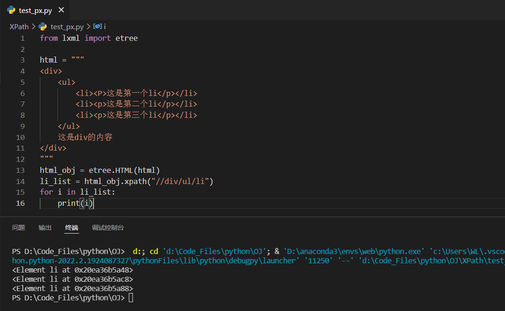
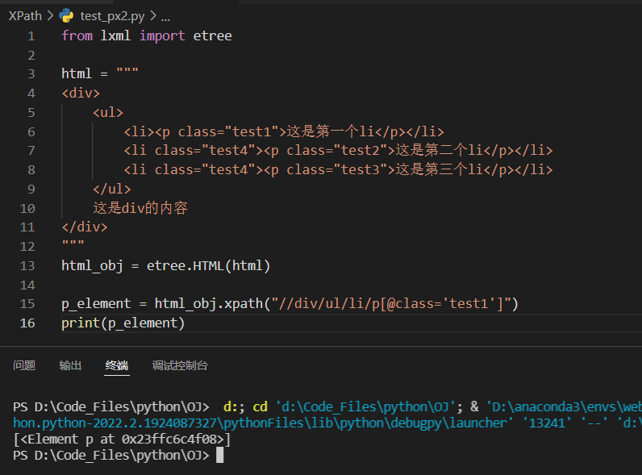
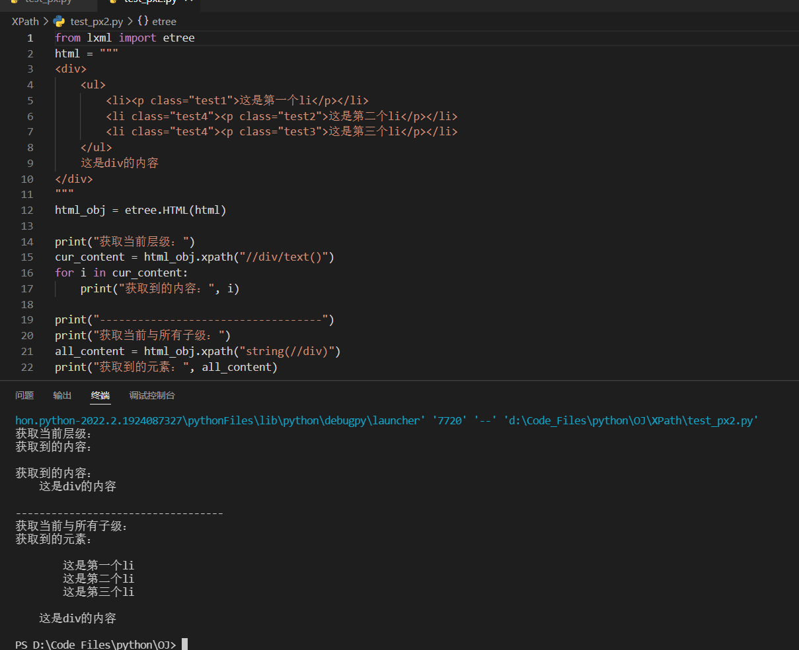
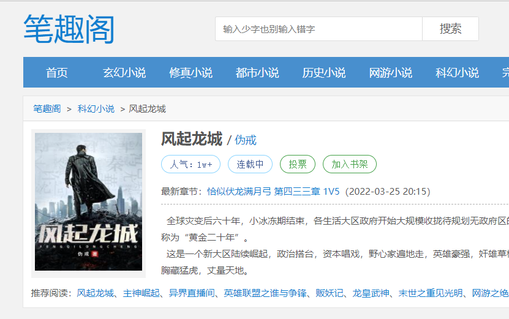
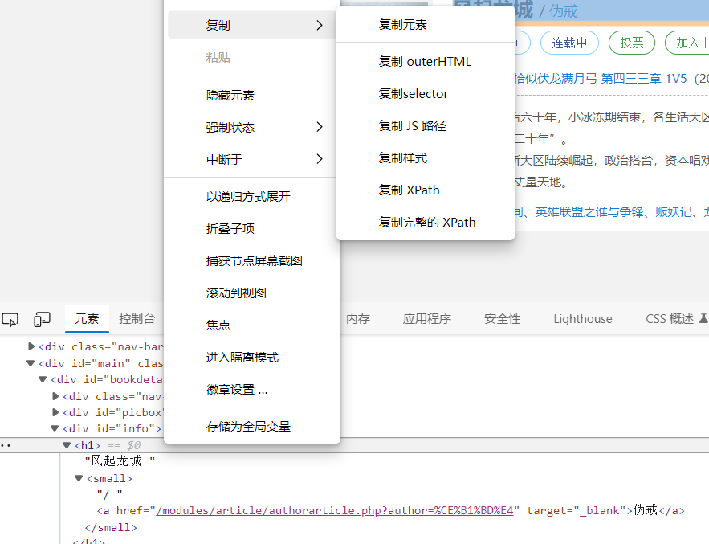
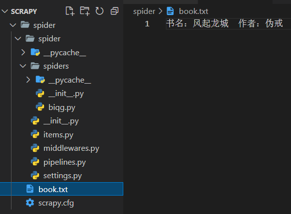
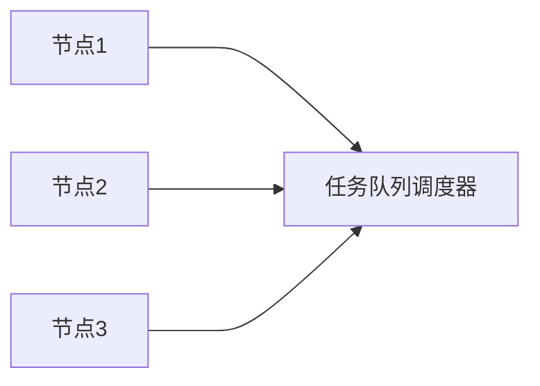

本文是我阅读 Python 数据分析与大数据处理（朱春旭著）的学习记录，如有进一步学习需求可以自行购买阅读。

<!--more-->

<br>

# XPath 网页解析

网页解析的过程，就是从网页中提取有用的信息的过程。由于不同内容在网页上表达方式的不同，我们可以定位特定信息进行提取。

<br>

## 网页解析工具

从网页中提取内容一般使用两种方式：使用正则表达式做匹配、使用现成的解析工具。正则表达式功能强大，但是对于复杂的网页并不友好。解析网页的工具有很多，例如，Java 中有 HTMLParser、Jsoup，Python 中有 Lxml、BeautifulSoup，等等。

<br>

## XPath 语法

XPath 是一种用来确定 XML 文档中元素位置的一种语法，同样适用于在 HTML 文档中定位元素。

在使用 XPath 之前需要导入 lxml 包：

```py
from lxml import etree
```

正常导入后，就可以定位元素，获取其中的内容了。

<br>

**1、通过路径定位元素并获取内容**



如图所示，其中 html 是一段简单的 html 字符串字段，调用 `etree.HTML` 方法，将其转化为 `lxml.etree._Element 类型`，然后就可以使用 XPath 语法定位元素了。其中字符串 "//div/ul/li" 表示的是：先从根上查找 div 元素，在查找其中的 ul 元素，最后定位到 li 元素。

最后，输出的每一个 li 都是一个 Element 对象。

若只需定位 html 片段中的第一个 li 元素，可修改 XPath 如下：

```xpath
//div/ul/li[1]
```

注意，多个元素的索引，下标是从 1 开始的。

这里更改代码，获取第一个 li 下 p 元素的文本内容：

```py
p_content = html_obj.xpath("//div/ul/li[1]/p/text()")
print("获取到的内容", p_content)
```

结果如下：


<br>

**2、通过属性定位元素并获取内容**

给 html 添加 class 属性，可以通过该属性定位元素：



如上图所示，筛选 li 元素中属性 class='test1' 的 p 元素。结果输出第一个 p 元素的信息。

html 片段中包含两个 class='test4' 的 li，可以使用 "\*" 全部取出，修改 XPath 路径如下：

```xpath
//div/ul/*[@class='test4']
```

在这些 html 元素中，class 都是以 test 字符串开头的，因此想一次性获取所有属性中包含 test 字符的 li 元素，可以使用 `start-with` 方法。修改代码如下：

```py
li_list = html_obj.xpath("//div/ul/li[start-with(@class,'test')]")
for i in li_list:
    print("获取到的元素", i)
```

结果如下，获取到两个 li 元素：


<br>

**3、提取当前层级和子层级的内容**

如下图所示，在 XPath 中，使用 `text()` 可获取当前级别的内容，使用 `string()` 则可以获取当前级别与所有子级的内容。其中第 15 行的 "//div/text()" 表达式只能获取与 div 同一层级的文本，包括换行符等空文本，第 21 行的 "string(//div)" 可以获取当前层级与嵌套的子元素的内容。

代码和执行结果如图：



> 注意，html 元素间的换行符和缩进都会被提取出来。

<br>

# Scrapy 数据采集入门

网络爬虫 通过向站点发起 HTTP 请求来获取内容。Scrapy 是 Python 中的一种爬虫框架，其丰富的功能可以为开发者节省大量的时间和精力。同时，使用 scrapy_redis 插件还可以迅速搭建分布式爬虫。

<br>

## 框架简介

Scrapy 是一个半成品的爬虫，需要用户基于 Scrapy 框架进行二次开发。Scrapy 包含队列、下载器、日志、异常管理等功能。在使用上，Scrapy 更多的是给框架配置参数，然后根据特定网站编写具体的爬取规则，其他的如并行下载，就由框架处理。

<br>

### Scrapy 架构

如图所示，Scrapy 由多个组件构成：

（1）Scrapy Engine：Scrapy 引擎是 Scrapy 的核心组件，用来处理 Scrapy 整个框架的数据流。

（2）Scheduler：调度器，引擎会将请求交给调度器进行排队，由调度器决定下一个爬取的网络地址。

（3）Downloader：下载器，会自动下载网页，并将网页内容传递给 Spider。

（4）Spiders：开发 Scrapy 过程中最重要的部分。在这里用户可以提取网页中的数据，即实体，用 “item” 表示；也可以提取链接，让 Scrapy 继续爬取。

（5）Item Pipeline：项目管道，用于处理 Spider 抽取的实体，比如数据清洗、数据持久化等。

（6）Downloader Middlewares：下载器中间件，主要用于处理引擎和下载器之间的请求与响应。

（7）Spider Middlewares：爬虫中间件，主要用于处理 Spider 的响应和输出。

（8）Scheduler Middlewares：调度中间件，主要用于处理引擎和调度器之间的请求与响应。


<br>

### Scrapy 数据流

当爬虫启动后，数据会按照一定流程在各组件间传递，如图所示：

（1）Scrapy 引擎将所有 URL 传递到调度器

（2）Scrapy 引擎从调度器中请求下一个待爬取的 URL

（3）Scrapy 引擎将获取到的 URL 传递到下载器

（4）下载器获取到一个页面就返回给 Scrapy 引擎

（5）Scrapy 引擎将收到的页面响应传递给 Spider

（6）Spider 处理响应并返回给 Scrapy 引擎实体和新请求

（7）Scrapy 引擎将收到的实体传递给项目管道，将新的请求传递给调度器

（8）回到第 2 步继续处理下一个网址，直至处理完毕

<br>

## 框架安装及创建项目

**框架安装**

使用如下命令安装 Scrapy：

```txt
pip install scrapy
```

注意，Scrapy 在安装过程中会自动下载并安装多个库，如 Twisted、pyOpenSSL、parsel 等。

安装完成后，验证 Scrapy 安装：

```txt
scrapy version
```

<br>

**创建项目**

使用如下命令创建 Scrapy 创建项目：

```txt
scrapy startproject project_name
```

创建的 Scrapy 项目结构，如图：


（1）spiders：用来存放具体的爬虫代码。

（2）items.py：存放实体类的文件，实体类需要从 scrapy.Item 继承，用来表示爬虫提取到的数据。

（3）middlewares.py：用来处理 Scrapy 引擎和各组件之间的请求和响应。

（4）pipelines.py：用来处理爬虫传递过来的实体。

（5）settings.py：框架配置文件。

（6）scrapy.cfg：项目配置文件在部署时可能需要修改，其所在目录就是根目录。

<br>

## 实现爬虫

<br>

### 创建爬虫

在项目根目录打开终端，输入命令：

```txt
scrapy genspider biqg bbiquge.net
```

在 spiders 目录下创建了一个 biqg.py 文件，代码如下：

```py
import scrapy      # 引入 Scrapy 框架

class BiqgSpider(scrapy.Spider):         # 从 scrapy.Spider 类继承
    name = 'biqg'                   # 爬虫名称
    allowed_domains = ['bbiquge.net']        # 允许爬取的网站域名列表
    start_urls = ['http://bbiquge.net/']     # 开始爬取的 URL

    def parse(self, response):      # 解析爬取到的网页，参数 response 就是下载器下载网页后的响应
        pass
```

<br>

### 爬取网页

在这一部分将实现网页内容的爬取，我的目标是记录笔趣阁的一部小说介绍，书名及作者。

<br>

**1、导入需要的包。**

```
from lxml import etree

from spider.items import Book
```

`etree.HTML` 方法可以将 html 字符串转化为 lxml.etree.\_Element 类型，接下来就可以使用 XPath 语法定位元素（Element 对象）并使用 `text()` 方法提取元素中的文本内容。

我们将在 items.py 文件中定义实体 Book，为了让 biqg 爬虫中可以将提取到的内容存储在实体中，预先导入 Book 类。

<br>

**2、确定待爬取的 URL，和元素的 XPath 路径。**



URL：https://www.bbiquge.net/book_133303/



打开开发者工具，检查你需要的元素，得到该元素的 XPath 路径。

<br>

**3、重写 parse 方法来解析爬取到的网页；创建实体来定义提取的目标数据对象。**

biqg 爬虫的 parse 方法：
```py
def parse(self, response):
    html = response.text     # 将 response 转化为字符串
    html_obj = etree.HTML(html)    # 将 html 字符串转化为 lxml.etree._HTML 类型
    item = Book()        # 
    item["title"] = html_obj.xpath(
        '//*[@id="info"]/h1/text()'
    )[0]
    item["author"] = html_obj.xpath(
        '//*[@id="info"]/h1/small/a/text()'
    )[0]
    return item
```

item 定义实体类：
```py
class Book(scrapy.Item):
    title = scrapy.Field()
    author = scrapy.Field()
```

在终端中，输入以下命令启动爬虫：
```txt
scrapy crawl biqg
```

结果如下：


<br>

**4、存储数据。**

我计划创建一个 BiqgPipeline 实体管道。在 biqg 爬虫的 parse 方法中，`return item` 会将实体传递到管道。在 pipelines.py 文件中，添加处理实体的逻辑——将实体保存为 txt 文件：
```py
class BiqgPipeline(object):
    def process_item(self, item, spider):
        with open("book.txt", "ab") as file:
            content = "书名：{0} 作者：{1}"\
            .format(item["title"], item["author"])
            file.write(content.encode(encoding='utf-8'))
```

在存储数据之前， 需要在 settings.py 文件中启用实体管道：
```py
# Configure item pipelines
# See https://docs.scrapy.org/en/latest/topics/item-pipeline.html
ITEM_PIPELINES = {
    'spider.pipelines.SpiderPipeline': None,
    'spider.pipelines.BiqgPipeline': 300,
}
```

其中参数 spider.pipelines.BiqgPipeline 表示处理实体的管道类的全路径，对应值300表示管道运行优先级（0~1000），数值越小，优先级越高。

注意：文件对象会占用操作系统的资源，并且操作系统同一时间能打开的文件数量也是有限的。因此，文件打开必须要关闭，即调用 `.close()` 方法。不过，由于文件打开和读写可能会出错，因此我们需要使用如下格式以保证文件打开和读写不会造成麻烦：
```py
try:
    f = open('/path/', 'r')
    print(f.read())
finally:
    if f:
        f.close()
```

每次都这么写实在太繁琐，所以，Python引入了 with 语句来自动帮我们调用 close() 方法：
```py
with open('/path/to/file', 'r') as f:
    print(f.read())
```

使用 `str.encode()` 方法可以指定字符串编码的方式，在这里我使用 utf-8 的编码方式。由于对字符串编码会导致其变成二进制格式的数据，因此我们需要将文件打开方式设置为 ab（以二进制格式打开一个文件用于追加）。

启动爬虫，结果如下：



<br>

### 常用命令总结
Scrapy 使用交互式命令来创建项目、生成爬虫、启动爬虫，同时这些命令还提供了检查 XPath 语法，查看爬虫获取到的页面等功能，你可以使用这些命令来做基本的调试。

<br>

**一、创建项目**
```txt
scrapy startproject spider
```

其中 spider 是项目名称，其项目根目录下有一个 scrapy.cfg 文件。

<br>

**二、创建爬虫**
```txt
scrapy genspider example example.com
```

其中 example 表示爬虫名称，example.com 是待爬取的网站。

<br>

**三、启动爬虫**
```txt
scrapy crawl example
```

<br>

**四、检查 XPath**
```txt
scrapy shell https://www.bbiquge.net/
```

该命令会启动一个 shell，同时 SCrapy 会自动下载该网站首页。在 Shell 窗口中，Scrapy 会创建几个常用对象。如图所示，其中的 response 对象就是 parse 方法中的 respponse 参数。


该 Shell 工具检查 XPath 语法：
```txt
response.xpath('//*[@id="container"]/div[1]/div[2]/dl/dt/a')
```

<br>

**五、查看爬虫列表**
```txt
scrapy list
```

<br>

## Scrapy 应对反爬虫
如果一个站点发现或怀疑请求网页的程序不是真人实际操作浏览器发起的，那么该站点就会怀疑这是一个爬虫程序。使用爬虫程序可以自动频繁的访问某个站点，如果该站点包含高质量的原创内容，那么不仅会消耗站点流量资源，还可能会被不法分子窃取有价值的内容。

<br>

### 反爬虫简介
反爬虫程序一般基于以下几点来判断当前请求是否由一个爬虫程序发起。

<br>

**1、Headers**

反爬虫程序一般会检查请求 Headers 信息的 User-Agent 是否为真实浏览器发起的。在爬虫中设置 User-Agent 的内容，可以绕过简单的反爬虫程序。


<br>

**2、IP 地址**

若是同一个 IP 地址在反复请求一个站点，请求频率看起来不像是人为的，也会被认为是爬虫。因此调差爬取网页的时间间隔和 IP 地址，能应付大多数反爬虫程序。

<br>

**3、身份信息**
很多站点都需要登录才能进行下一步的操作。因此针对具有复杂验证码的站点，以及具有复杂身份验证的验证，需要使用功能强大的算法并配合自动化测试工具等技术，才能完成爬取。

反爬虫的机制多种多样，其算法也会随着爬虫的调整而逐步升级。在反反爬虫的过程中，并没有一劳永逸的做法。

<br>

### Scrapy 应对反爬虫
Scrapy 提供了一些配置和扩展来应对反爬虫，这里介绍几种常见方式。

<br>

**1、配置 Headers**

修改框架的 settings.py 文件中 USER_AGENT 节点。
```py
# Crawl responsibly by identifying yourself (and your website) on the user-agent
USER_AGENT = 'Mozilla/5.0 (Windows NT 10.0; Win64; x64) '\
    'AppleWebKit/537.36 (KHTML, like Gecko) '\
    'Chrome/99.0.4844.74 Safari/537.36 Edg/99.0.1150.46'
```

这样当爬虫发起请求时，会在 Headers 中使用该配置，使请求看起来更像是浏览器发出的。

除此之外，你还可以修改 DEFAULT_REQUEST_HEADERS 节点：
```py
DEFAULT_REQUEST_HEADERS = {
    'Accept': '',
    'Accept-Language': '',
    'User-Agent': ''
}
```

该节点的修改可以覆盖整个 Scrapy 的 HTTP 请求。

<br>

**2、禁用 robots 协议**

robots 协议是网站和爬虫之间的协议，形式上是一个网站根目录下的文本文件。该文件告诉爬虫能访问的站点范围，如果没有该文件，则整个站点爬虫都可以访问。

默认情况下，Scrapy 是遵循 robots 协议的，在 settings.py 中修改：
```py
# Obey robots.txt rules
ROBOTSTXT_OBEY = False
```

<br>

**3、延迟下载和自动限速**
取消 DOWNLOAD_DELAY 注释，限制爬虫的下载速度，避免被当作爬虫。
```py
# See also autothrottle settings and docs
DOWNLOAD_DELAY = 3
```

延迟爬虫下载时间的算法：DOWNLOAD_DELAY 乘以一个范围在 0.5~1.5 的随机值。

若不清楚下载速度具体在设置为多少，你可以让 Scrapy 自动调整下载速度：
```py
# Enable and configure the AutoThrottle extension (disabled by default)
# See https://docs.scrapy.org/en/latest/topics/autothrottle.html
AUTOTHROTTLE_ENABLED = True
```

<br>

**4、使用中间件**

下载器中间件处于 Scrapy 引擎和 Scrapy 下载器之间，用来处理 Scrapy 发起的请求和下载的响应。因此，可以使用下载器中间件来修改 USER_AGENT 和请求的 IP，以迷惑反爬虫程序。

接下来，我以使用中间件修改 USER_AGENT 为例。

<br>

（1）在 settings.py 中创建 USER_AGENTS 列表。不同浏览器的 User-Agent 字段不同，你可以收集不同的 User-Agent 字段作为列表的元素：
```py
USER_AGENTS = [
  "",
  "",
  ""
]
```

（2）创建 User-Agent 中间件。在项目的 middlewares.py 文件内，创建类继承 UserAgentMiddleware 并重写 process_request 方法。
```py
import random
from scrapy.downloadermiddlewares.useragent import UserAgentMiddleware
from spider.settings import USER_AGENTS

class CustomerDownloaderMiddleware(UserAgentMiddleware):
    def process_request(self, request, spider):
        user_agent = random.choice(USER_AGENTS)
        request.headers.setdefault("User-Agent", user-agent)
```

（3）启用中间件。在 settings.py 文件中解除 DOWNLOADER_MIDDLEWARES 节点注释，并将 CustomerDownloaderMiddleware 类的全路径作为 key 写入字典。这里需要使用自定义的中间件，停用框架内置的中间件。
```py
# Enable or disable downloader middlewares
# See https://docs.scrapy.org/en/latest/topics/downloader-middleware.html
DOWNLOADER_MIDDLEWARES = {
    'scrapy.downloadermiddlewares.useragent.UserAgentMiddleware': None,        # 执行优先级为 None，不再使用该中间件
    'spider.middlewares.CustomerDownloaderMiddleware': 544          # 中间件的执行优先级
}
```

（4）若要创建 HTTP 代理中间件，在项目的 middlewares.py 文件内创建类继承 HttpProxyMiddleware 并重写 process_request 方法。同样，在 settings.py 中配置 DOWNLOADER_MIDDLEWARES 节点启用 HTTP 代理中间件。

<br>

# CrawlSpsadawdawwider 类
大多数网站的页面链接在命名上都有一定的规则，使用 CrawlSpider 类可以根据这些规则实现全站爬取。

<br>

## 核心概念
CrawlSpider 是 Spider 的子类，Spider 爬取的是 start_urls 指定的链接，而 CrawlSpider 则是根据一定的规则在 start_urls 的基础上进一步跟进：在 start_url 指定的链接的页面内部，如果包含了满足 CrawlSpider 规则的链接，那么 CrawlSpider 会筛选出这些链接，继续爬取：

创建 CrawlSpider 爬虫的命令格式如下：
```txt
scrapy genspider -t crawl biqg bbiquge.net
```

<br>

CrawlSpider 的规则是一系列 Rule 对象的元组。创建 Rule 对象的重要参数含义如下：

（1）link_extractor：该参数是 LinkExtractors 对象的实例，该实例指定了网页内部链接的提取规则，规则使用正则表达式表示。

（2）callback：callback 指向一个回调函数。当满足 link_extractor 条件链接的网页被下载后，会自动调用 callback，并将请求的响应传递给 callback，这时可在回调函数中提取数据。注意：在 CrawlSpider 的子类中不要定义 parse 方法，因为 CrawlSpider 采用 parse 方法实现其他逻辑。

（3）follow：表示提取到的内部网页是否需要跟进。若 callback 为 None，则 follow 默认为 True，否则 follow 默认为 False。因此，若指定了 callback 又需要持续跟进，在创建 Rule 时，可指定该参数如下：

```txt
Rule(link_extractor, callback="parse_item", follow=True)
```

（4）process_links：主要用来过滤 link_extractor 提取到的链接。

（5）process_request：主要用来过滤 link_extractor 提取到的请求。

在开发过程中，最常用到的三个参数是 link_extractor、callback 和 follow。

<br>

创建 LinkExtractor 对象的实例也需要指定几个参数。

（1）allow：指定正则表达式，满足条件的链接才会被提取。若该值为空，则页面中的所有链接全部被提取。

（2）deny：指定正则表达式，满足条件的链接不会被提取。

（3）allow_domains：指定一个或多个域名，在该域名下的链接才会被提取。

（4）deny_domains：指定一个或多个域名，在该域名下的链接不会被提取。

（5）tags：指定 html 元素，默认为 'a' 和 'area'，提取链接时会从这些元素中提取。

（6）attrs：指定 html 元素属性，默认为 'href'，提取链接时会从这些元素属性中提取。

（7）unique：用于设置对提取到的链接是否进行重复过滤。

（8）restrict_xpaths：接收一个 XPath 表达式或一个 XPath 表达式列表，提取 XPath 表达式选中区域下的链接。

（9）restrict_css：和 restrict_xpaths 使用一样，只是使用规则不一样。

<br>

## 爬取网络数据

使用 CrawlSpider 爬取笔趣阁的数据，项目链接：[a-pin/crawlspider (github.com)](https://github.com/a-pin/crawlspider)

实际上，还可以通过循环发起 Requset 请求调用 parse 方法实现爬取。

<br>

# 分布式爬虫

大型数据采集任务需要设计分布式爬虫，为了使爬取的效率尽可能高，一般会采用多进程的形式。然而当这些进程分布到不同机器上时，如何统一分配采集任务、统一去重，成了程序员要面临的问题。下面就来了解分布式爬虫。

<br>

## 分布式爬虫架构

在分布式爬虫架构中，请求队列由中央服务器统一维护，各爬虫进程也由中央服务器统一调用。如图所示，各节点可分别运行爬虫程序，然后由调度器统一管理。



## 使用 scrapy_redis 构建分布式爬虫

scrapy_redis 是一个 Python 库，可以将 redis 作为多个 Scrapy 爬虫的一个共享队列。scrapy_redis 中包含 Scrapy 即插即用的组件，如调用器、管道等。

<br>

1、安装 redis

首先需要安装 redis 数据库。redis 官方并不支持 Windows，但是可以从 github 上下载到 Windows 版本。

[Releases · microsoftarchive/redis (github.com)](https://github.com/MicrosoftArchive/redis/releases)

解压后文件目录：


步骤一：进入安装目录后，使用如下命令直接启动：

```txt
.\redis-server.exe redis.windows.conf
```

启动状态如图所示，redis 正在监听6379端口。


步骤二：保持上一个终端不关闭，打开新的终端，启动客户端

```txt
redis-cli.exe
```

启动状态如图：


注意：由于 redis_server.exe 运行在终端上，我们只要把窗口关闭，redis 就不能再使用。可使用命令将 redis 安装成 Windows 服务。

```txt
.\redis-server --service-install redis.windows.conf --loglevel verbose
```

相应启动服务命令和停止服务命令为：

```txt
.\redis-server.exe --service-start  # 启动服务
.\redis-server.exe --service-stop   # 停止服务
```

<br>

2、配置 scrapy_redis

步骤一：安装 scrapy_redis 库：

```txt
pip install scrapy_redis
```

步骤二：安装完毕后，从 scrapy_redis 中导入 RedisCrawlSpider：

```python
from scrapy_redis.spiders import RedisCrawlSpider
```

接着，修改 spider 项目 BiqgSpider 爬虫类继承 RedisCrawlSpider，同时改 start_urls 为 redis_key。

步骤三：在 settings.py 中添加配置：

```python
# Configure item pipelines
# See https://docs.scrapy.org/en/latest/topics/item-pipeline.html
ITEM_PIPELINES = {
    'spider.pipelines.SpiderPipeline': None,
    'spider.pipelines.BiqgPipeline': 300,
    'scrapy_redis.pipelines.RedisPipeline': 200
}

# 使用 scrapy_redis 的调度器
SCHEDULER = "scrapy_redis.scheduler.Scheduler"
# 使用 RFPDupeFilter 对去重
DUPEFILTER_CLASS = "scrapy_redis.dupefilter.RFPDupeFilter"
# redis 服务器地址
REDIS_URL = "redis://localhost:6379"
```

步骤四：将项目复制两份，在不同目录下启动。

```txt
scrapy crawl biqg
```

此时爬虫会暂停执行，等待链接输入。

步骤五：打开 redis 客户端，输入待爬取链接，其中 redis_key 为 `biqg:start_urls`

```txt
.\redis-cli.exe
lpush biqg:start_urls https://www.bbiquge.net/book_133312/
```

步骤六：当向队列中添加一个链接时，就会有一个爬虫从队列中读取 key，然后继续执行。

步骤七：由于在 settings.py 中启用了 redis 管道，因此会被优先执行，使提取的数据最终存入 redis。
